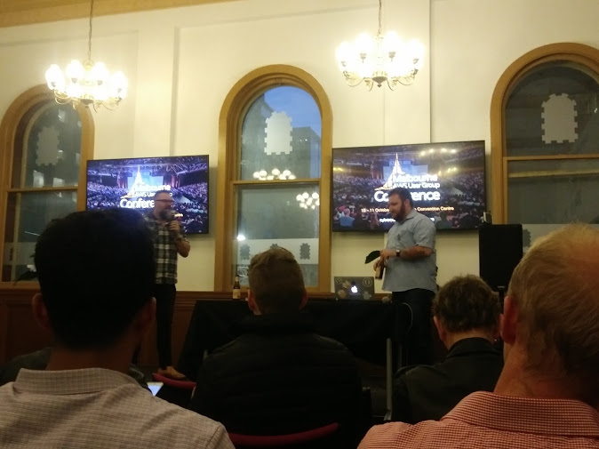
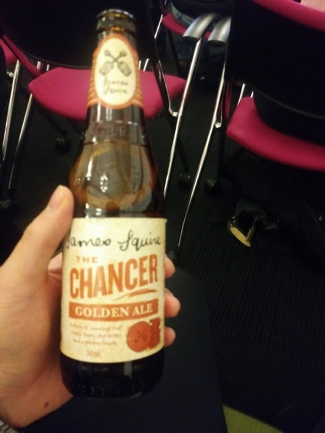
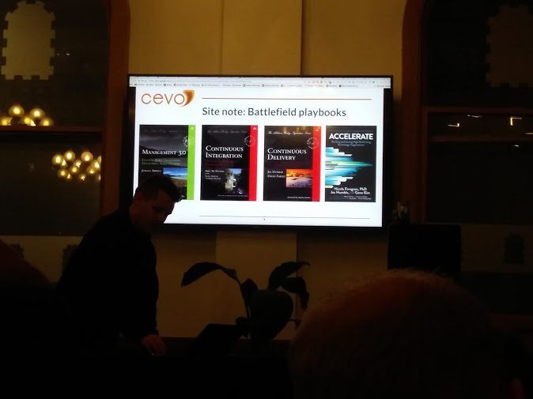

###### *Meetup: Melbourne AWS User Group*
###### 참석일자: 2018. 08. 29. 수요일 6:15pm ~ 8:30pm
서울에 머물고 있었을 때 2개의 밋업과 1개의 컨퍼런스에 참석한 적이 있다.
다른 개발자들은 뭘하고 사는지에 대한 밋업이었던 **개발자 이야기**,
Vue 이용자들의 모임 **뷰티풀 코리아~Vuetiful~ ~Korea~**, 그리고
대규모 AWS 컨퍼런스였던 **AWS Summit**.
호주에서 IT 모임을 경험한 건 처음이라 일반화해선 안되지만
한국에서와 눈에 띄게 달랐던 점을 적어보고자 한다.

## 타투를 한 개발자들

나이가 지긋해 보이는 진행자 형님들이 타투[^tatto]를 했다는 것,
뿐만 아니라 참석자 대부분이 정말 세련되게 잘 꾸며입었다는 것이 새로웠다.
내가 알던 개발자의 후줄근한 이미지와 달라서 조금 인지부조화가 왔다.
아마 멜버른에서 거주하는 분들이 많이 와서 더 그랬던 것 같다[^melbourne].

## 노골적인 네트워킹
2개의 강연이 끝나고 쉬는 시간 격인 네트워킹 시간을 가졌다.
이름이 '네트워킹 시간'이었다...! 
이 시간이 시작하기 전에 진행자는 네트워킹을 장려하는 멘트를 했고,
혹시 구인을 하러 온 사람이 있으면 손을 들어 간단히 소개하라고도 했다.
기억나기로,
> "*오늘 A사에서 구인차 사람이 왔습니다. 네, 저기 손들어주신 분이구요.
> 관심 있으시면 네트워킹 시간에 말씀 나누시면 되겠습니다.
> 또 따로 구인하러 오신 분 있나요? 아, 네 말씀해주시죠*"  

그러자 새로운 스타트업을 구상하고 있는 사람이 공동대표를 구한다며
관심 있으면 오라고 했다. 

그렇게 구인구직을 위해 만남을 가지는 분들도 있었고, 
다른 분들은 자유롭고 자연스럽게 서로 얘기를 나누었다.
나도 데이터 엔지니어 두 분과 얘기를 나누다가 구인차 왔다던 
사람에게 가서 이런저런 얘기를 들었다. 
물어보는 것마다 친절하게 조목조목 알려줘서 
편안하게 정보를 얻을 수 있었다.

## 맥주와 피자

역시 개발자 밋업답게 먹을 게 빠지지 않았다. 
장소와 요기거리 모두 기업들이 후원했기 때문에 참석비가 무료였던 것 같다.
재밌었던 건 시작부터 끝까지 병맥주가 계속 제공됐다는 점.
한국에 없던 라벨들이라 다 마셔보고 싶었지만, 
두 병밖에 마시지 못해 아쉬웠다.
다들 일상처럼 맥주를 홀짝이며 강연 듣고 얘기하고 하는 게 신기했다.

네트워킹 시간이 되자 때맞춰 피자가 도착했다.
피자도 너무 맛있었다.
다음 달엔 허기진 상태로 참석해야겠다.

## 무지 다국적, 무지 남녀노소
당연하다 싶다. 여긴 영어를 사용하고, 살기 좋기로 유명한 호주.
전세계에서 인력이 모일 것만 같다.
호주 사람도 많고, 인도인처럼 보이는 분들, 
아시안도 몇몇 보였고, 여성 개발자들도 보였다.
(근데 확실히 여성 개발자 수가 현저히 적었다.)

가장 인상깊었던 건 새하얀 머리를 포니테일로 묶고 검정 가죽 재킷을 입은
할아버지가, 강연 주제였던 기술이 실무에 특정 방식으로도 적용 될 수 
있는지 질문을 던지는 모습이었다[^oldie].

위에서 만났다고 한 데이터 엔지니어 2분은 모두 중국인 아주머니셨다.
두 분중 한 분은 프론트엔드 개발자로 일하다가 데이터 엔지니어로
넘어가셨다고 했다. 하는 일은 데이터베이스 쿼리문 짜시는 거라고... .

## 얻어온 것들 
이런 밋업에 자주 참여해서 같은 분야 사람들 많이 만나고,
내가 발전할 수 있는 기회를 잘 잡는 게 중요하겠다고 느꼈다.

 읽으면 좋을 것 같은 책들 (프로젝트 관리) 

| 키워드 | 내가 이해한 뜻 |
| --- | --- |
| Zero Trust Security | 믿지 말고 항상 인증을 시키라는 보안 철학~Always~ ~Verify~.  따르면 확실히 안전해질 것 같았다. | 
| Data Platform | Database, Data Lake 들과는 또 조금 다른 개념. 데이터 생성자, 인제스터, 소비자 정도로 엑터~actor~가 나뉜다. 데이터의 API화 정도로 이해를 했다. | 

[^tatto]: 호주에선 타투가 정말 흔하다. 최근에 법적으로 18세 이상이어야 타투를 받을 수 있게 변했다고 하니, 타투가 합법이고, 남녀노소가 즐기는 문화인 것 같다.  
[^melbourne]: 정말 사람들이 잘 꾸미고 다니는 곳이다. 일만 있다면 먹고 살만하고, 돈도 모을만 해서 그런 걸까. 
[^oldie]: 그날 밤 언어교환 모임이 있는 바에서 나이가 40 중반인데, 계속해서 개발을 하시는 분을 만날 수 있었다. 자기가 하는 일이 너무 좋다고 하시는데 참 멋졌다. 우리나라 업계 상황을 안겪어봤지만 듣기로는 나이가 차면 개발자에서 매니저로 간다고들 한다. 그런 말을 들어서인지, 나이가 꽤 있으신 분들이 열심히 실무에서 뛰는 모습이 인상깊었다. 
