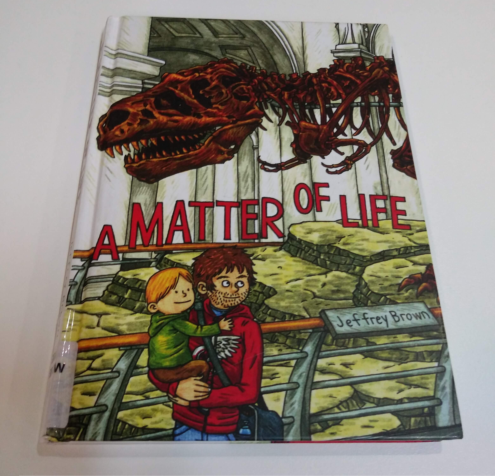

###### Author: Jeffrey Brown
###### period: 23.08.2018  
###### place: City Library in Melbourne

목사의 아들, 미국인, 만화가, 아버지, 무신론자가 그린 독백조의 자전적 그래픽 노벨

---

제목 *a Matter of Life*를 보고 나는 관용어구
*as a matter of fact*가 떠올랐다.
이 어구는 '사실은, 다름이 아니라' 등으로 옮겨진다.
얘기가 화자와 청자에 대한 것이 아니라,
사실에 대한 것이라 주장할 때 쓰는 
정치적인 표현이다[^FYI].
상대방에게 사실을 해석할 자유를 주는 듯 하지만, 
사실과 주장은 화자가 이미 정해놓았고, 
청자가 읽어낼 수 있는 암시의 선택지도 이미 편집되었다.
주로 상대방의 오해를 정정할 때 사용되고,
팩트를 둘러 싼 말다툼의 효시가 되기도 한다[^말다툼].
이 표현을 사용하는 것은 표면적으로는 정서를 배제하려는 의도지만, 
관점을 강요한다는 점에서 불쾌할 수 있는 시도다.

의도된 건지 아닌지, 
그림 속 화자는 수많은 as a matter of fact와 마주친다.
자식이 더이상 기독교인이 아니라는 걸 
인정하기 싫어하는 부모님과 주변 어른들,
신앙생활을 그만 둔 것이 몸에 영향을 미친 게 아니냐는 기독교인 의사,
악마숭배와 사이언톨로지 등 기타 종교에 매몰된 친구들,
화자의 아들이 신에게 잘 대하고 있는지 물어보는 꼬마 여자애 등.

각자가 속한 집단이 동의한 펙트, 
자신이 펙트라고 믿는 펙트 등을 가지고 많은 이들이 
다가오고 지나간다. 
신앙심 깊은 미국 백인 기독교 집안에서 자랐지만, 
신을 필요로 하지 않는 작가. 
스스로 예술가이기도 하고 다양한 사람들을 만나기도 하며, 
서로 모순되는 생각들을 계속해서 마주했을 것이다.

그 여정 중간에서 자신의 어린 아들과 죽어가는 아버지를 보며 
어떤 결론에 다다른 걸까.
결국 '팩트가 아니라 삶이 있다'라는 건 아닐까.
"삶이 있다, 삶에 대해 말하자면[^삶]"
그런 걸 말하고 싶었던 걸까?

_아래는 마음에 들어 적은 구절들이다._
- You don't need god to be good
- Every sixty million years or so,  
most of life on earth seems to get wiped out.  
So maybe we just shouldn't worry so much.  
In the future, all of this will be the past.  
In eight billion years, our sun will die...  
In one hundred some quintillion years,
our whole galaxy will evaporate away.  
In some unimaginable amount of time 
the whole universe will become a seemingly empty 
void of random mixed up particles or something

[^FYI]: 조금 더 문어적이고 형식적인 표현으로는 *For your information*이 있다.
[^말다툼]: "You didn't have to kill him." "I'm confused, as a matter of fact, you killed him." "No! He was already bleeding too much when I stabbed him in the stomach. It's your an hour of lynch that killed him."
[^삶]: As a matter of life, lives are being lived. 

배운 표현들

| 배운 표현 | 이야기 | 뜻 |
| --- | --- | --- |
| it didn't hurt that - | 영문에서도 이런 식으로 완곡히 표현하기도 하는 구나 | - 하는 게 나쁘진 않았다 |
| senile | growing old and senile freaks me out | 망령되다, 노망나다 |
| minister | 장관으로밖에 몰랐는데 | 목사, 사제 |
| congregation |  | 신자, 사도 |
| crinkle | origami is all about crinkling and folding paper | 주름이 생기다, 잔주름  |
| skritch | urban dictionary 에서는 '수염을 검지의 바깥 쪽으로 문지를 때 생기는 소리'라고 한다, 책에서는 그림/낙서를 할 때 생기는 소리를 표현하는데 사용됐다 | 의성어 |
| 바스대다 | 어감이 이쁘다, '나는 침착해야 한다고 생각하면서도 바스대었다'  | 군짓을 하며 자꾸 조금 움직이다, 마음이 설레다 |
| fidget |  | 꼼지락거리다, 바스대다 |
| bonk | | 퉁퉁 부딪히다 |
| flaky | 페이스트리를 묘사할 때 사용되었다, 알아두면 빵집에서 써먹지 않을까? | 얇게 벗겨지는 |
| easygoing | 이제까지 '쉽게 나가는, 외향적인' 이란 뜻으로 알고 있었는데... | 태평한, 느긋한 |
| chaplain | | 군인 사제 |
| sermon | | 설교 |
| albeit (올-비에트) | everyone survived, albeit injured | 비록 -일지라도 |
| consistory | | 교회 회의, 종교 법정 |
| detrimental | "forget this worship stuff, it's detrimental to our spiritiual well being," said a minister | 해로운 |
| extraneous | | 관련 없는 |
| communion | | 성찬식, 영성체, 종교 단체, 교감 |
| regurgitate (뤼-걸지테잍) | I realized that I've been regurgitating some else's words | (삼킨 음식물을 입 안으로 다시) 역류시키다, (듣거나 읽은 내용을 별 생각 없이) 반복하다 |
| hernia | 내장이 제위치에서 벗어난 걸 뜻한다고 한다 | 탈장 |
| push someone's button | reddit 에서도 이 표현을 이용한 농담조의 댓글을 읽었다, 인제 다시 보면 한 번에 이해하겠다 | To do speicific things to anger someone |
| leash | you should keep your dogs on leashs | 가죽끈, 사슬, 속박, 구속 |
| ordeal | | (힘들거나 불쾌한) 시련 |
| off and on | on and off 도 똑같은 뜻이다 | 때때로, 불규칙적으로 |
| pastor | | 목사 |
| legit | are they legit? | 합법적인 |
| it/that figures | 많이 쓰일 것 같다 | 그럴 줄 알았다 |
| pulmonary | | 폐의 |
| fibrosis | fiber가 섬유니깐, 섬유화는 섬유질 결합조직의 과다누적을 의미한다고 한다 | 섬유증; 섬유 형성 |
| prognosis | a gloomy prognosis, 예후(미리 예, 뒤 후) | 예후, 예상, 예측 |
| snuggle | 허그보다 강한 표현, 스너글하고 싶다 | 바싹 파고들다; 파묻다 |

