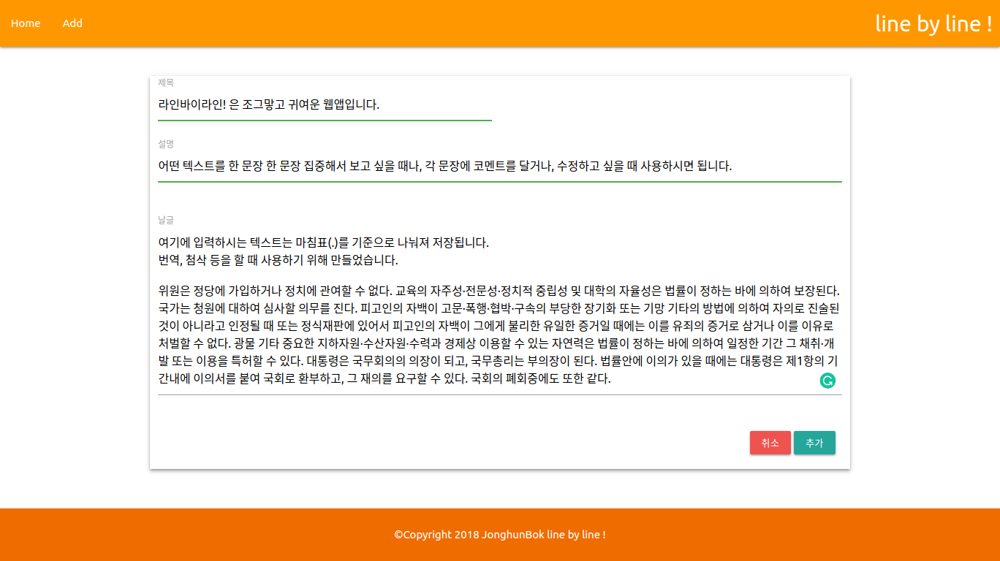
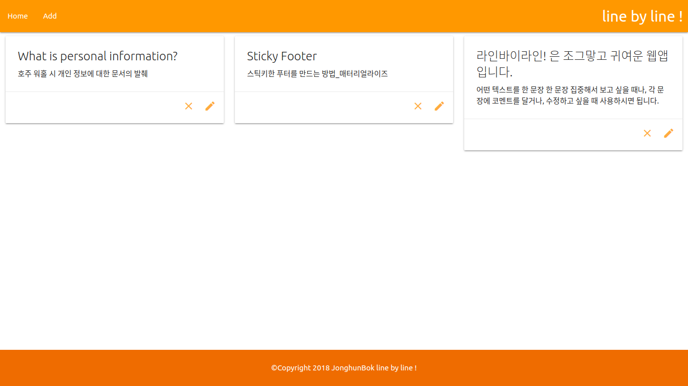
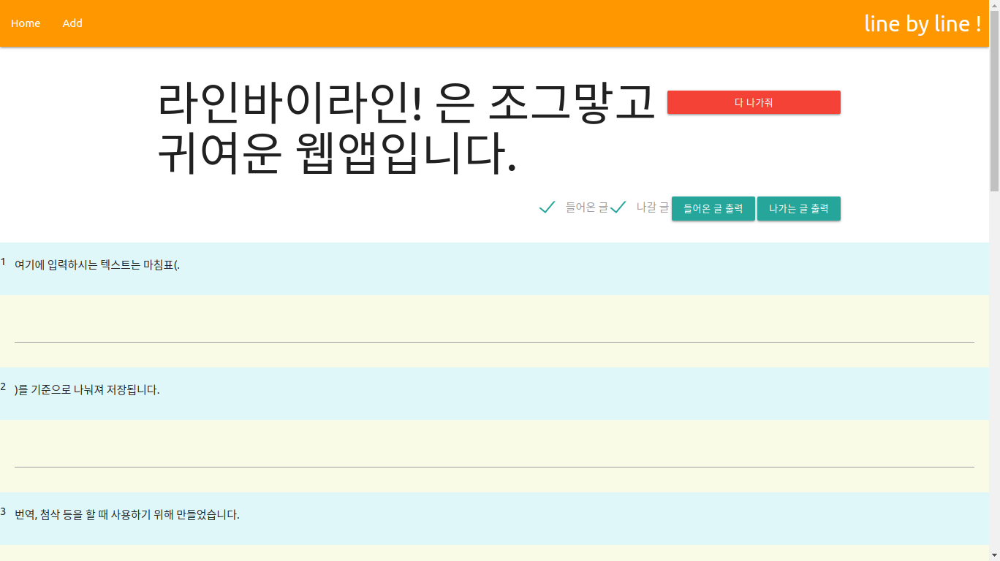
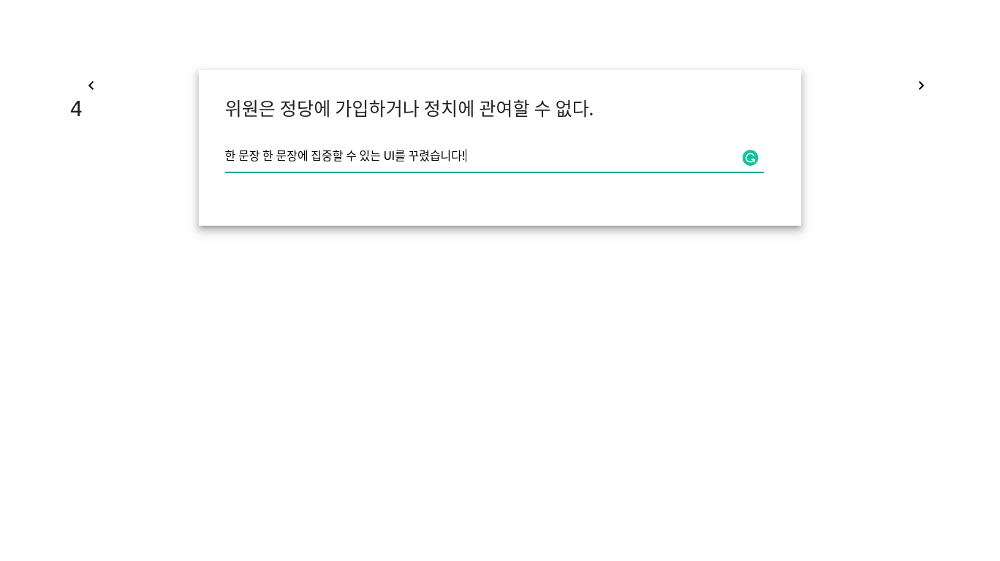

## 무엇인지

이미지 설명보기

 
 
 

 
 
 

 
 
 

 
 

  
  주어진 텍스트를 마침표(.)를 기준으로 구분해 한 문장 한 문장에 
  집중하면서 코멘트를 달거나, 수정본을 작성할 수 있는 웹앱.

## 왜 만들었는지
  주로 번역, 첨삭할 때 사용하려고 만들었다.
  공부를 하다보니 영어 자료를 많이 읽게 된다.
  블로깅을 하기 위해 번역을 하다보니,
  다음 두가지 문제가 있었다.
  1. 글을 띄엄띄엄 읽을 때가 있음.  
     그러다보니 내용 이해를 위해 두 번째 문제가 생김.
  2. 작업 중인 문장의 앞뒤 문장을 여러 차레 읽는데 시간을 쏟음.

&nbsp;&nbsp;&nbsp;&nbsp;그래서 한 줄 한 줄 번역을 도와주는 앱을 만들어야겠다고 생각했다. 
  (라인바이라인 번역이 항상 옳다고 생각하지는 않지만, 
   기술문서 번역은 라인바이라인이어야 한다고 생각한다)

## 소득
  우선 나의 귀여운 웹앱이 만들어졌다. 아주 작은 웹앱이지만 사이드 프로젝트를 하나라도 완성했다는 뿌듯함을 얻었다. 작은 프로젝트를 많이 해서 숙련도를 쌓고, 프로젝트를 하는 것에 대해 자신감이 생기면 좋겠다.

&nbsp;&nbsp;&nbsp;&nbsp;처음으로 straight-outta.coffee 도메인의 구매 목적에 맞는 사용을 했다. 작은 프로젝트를 많이 해서, 도메인을 하나씩 연결해주고자 가비아에서 저가의 도메인을 구매했다. 그런데 썩히고 있어서 마음 한편이 불편했는데, 숙원 사업 하나를 이룬 기분이다. 

&nbsp;&nbsp;&nbsp;&nbsp;http://linebyline.straight-outta.coffee 에 접속하면 웹앱을 사용할 수 있다.

## 숙제
- **잉크스케이프를 배울까 말까를 확실히 정하자.**
  배우면 귀여운 프로젝트에 파비콘이라도 넣어줄 텐데..
- 효율적인 데이터 관리를 위해 **Vuex를 배워야겠다.**
- 개발모드와 빌드한 결과물이 많이 다른데, 그 이유를 정확히 모르겠다.
  우선 **웹팩을 공부해야겠다**
- **flexbox**를 내가 처음부터 설명할 수 있을 정도로 공부를 해보자.
- **https를 도입**해야겠다.
 

### 공부 자료: 
 - [Vue JS 2 Tutorial, The Net Ninja](https://www.youtube.com/watch?v=5LYrN_cAJoA&list=PL4cUxeGkcC9gQcYgjhBoeQH7wiAyZNrYa)
 - [Vue 공식 사이트](https://kr.vuejs.org/v2/guide/index.html)

사용한 기술

 - Vue  
 - AWS S3  
 - AWS ROUTE53  
 - Materialize 

 
